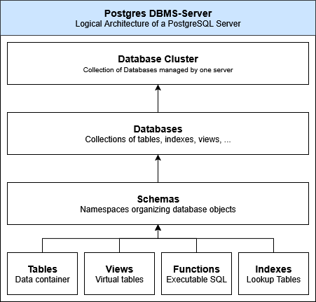
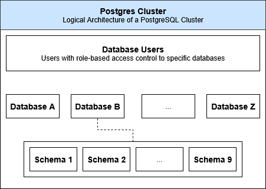

# Datastorage Technologies

- [Datastorage Technologies](#datastorage-technologies)
  - [Structured Data](#structured-data)
    - [Comma-separated values (CSV)](#comma-separated-values-csv)
  - [Semi-Structured Data](#semi-structured-data)
    - [Javascript Object Notation (JSON)](#javascript-object-notation-json)
    - [Extensible Markup Language (XML)](#extensible-markup-language-xml)
  - [Unstructured Data](#unstructured-data)
    - [Textformat (TXT)](#textformat-txt)
    - [Markdown (MD)](#markdown-md)
  - [Database Management Systems (DBMS)](#database-management-systems-dbms)
    - [Cluster](#cluster)
    - [Databases](#databases)
    - [Schemas](#schemas)
    - [Tables](#tables)
    - [Indexes](#indexes)
    - [Triggers](#triggers)
  - [Properties](#properties)
    - [Relational model](#relational-model)
    - [Atomicity, Consistency, Isolation, Durability (ACID)](#atomicity-consistency-isolation-durability-acid)
    - [Basic Availability, Soft State, Eventual Consistency (BASE)](#basic-availability-soft-state-eventual-consistency-base)
    - [Consistency, Availability, Partition-Tolerance (CAP)](#consistency-availability-partition-tolerance-cap)


## Structured Data

### Comma-separated values (CSV)

```csv
ID,Title,Genre
1,"Dune, Part One","Science Fiction"
2,"A Brief History of Time","Non-Fiction"
3,"The Name of the Wind","Fantasy"
```

## Semi-Structured Data

### Javascript Object Notation (JSON)

```json
{
  "LibraryName": "City Central",
  "Branches": [
    {
      "BranchID": "A",
      "Location": "Northside",
      "Collection": [
        {"ISBN": "1234", "Title": "Dune"},
        {"ISBN": "5678", "Title": "Foundation"}
      ]
    },
    {
      "BranchID": "B",
      "Location": "Southside",
      "Collection": [
        {"ISBN": "9101", "Title": "The Martian"}
      ]
    }
  ]
}
```

### Extensible Markup Language (XML)

```xml
<?xml version="1.0" encoding="UTF-8"?>
<User UserID="U0045" Status="Active">
    <Name>Jane Doe</Name>
    <DateJoined>2023-01-15</DateJoined>
    <ContactDetails>
        <Email>jane.doe@work.com</Email>
        <Phone>555-1234</Phone>
        <EmergencyContact>
            <Name>John Doe</Name>
            <Phone>555-9876</Phone>
        </EmergencyContact>
    </ContactDetails>
</User>
```


## Unstructured Data

### Textformat (TXT)

### Markdown (MD)

## Database Management Systems (DBMS)



### Cluster




### Databases

### Schemas

### Tables 

### Indexes

### Triggers

## Properties

### Relational model

### Atomicity, Consistency, Isolation, Durability (ACID)

### Basic Availability, Soft State, Eventual Consistency (BASE)

### Consistency, Availability, Partition-Tolerance (CAP)
